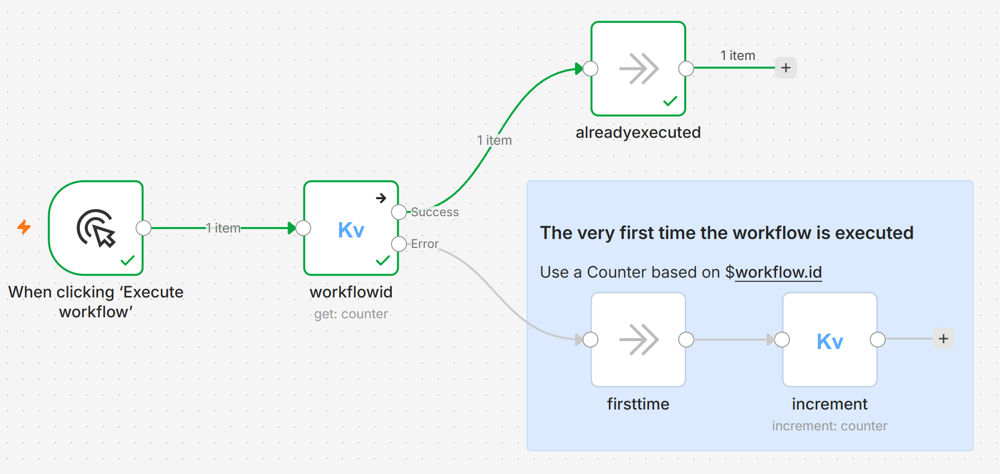

# n8n-nodes-keyvalue

A filesystem-based key-value store and trigger node for [n8n](https://n8n.io). Store, retrieve, list, and delete key-value pairs using plain directories and text files. Includes full-text search, vault navigation, tag management, and YAML frontmatter metadata. Also includes a trigger node that watches directories for new or changed records.

```
~/.n8n-keyvalue/          ← your store root
├── customers/            ← a directory
│   ├── alice             ← a record (text file)
│   └── bob
└── orders/
    ├── order_001
    └── order_002
```

## Installation

Install from the n8n community nodes panel, or:

```bash
npm install n8n-nodes-keyvalue
```

No external dependencies — uses only Node.js built-in modules (`fs`, `path`, `os`).

> **Note:** This node operates on the local filesystem and cannot run on n8n Cloud.

## Quick Start

1. Add a **KeyValue** node to your workflow.
2. Select **Directory → Create**, enter `my_dir`.
3. Add another KeyValue node, select **Record → Write**, enter directory `my_dir`, key `greeting`, value `Hello n8n!`.
4. Add a third node, **Record → Read**, same directory and key — outputs `Hello n8n!`.

## Operations Reference

### Counter Resource

| Operation | Fields | Description | Output |
|-----------|--------|-------------|--------|
| **Get** | Counter Name (required) | Reads the current counter value | `{ "counter": "name", "value": 42 }` |
| **Increment** | Counter Name, Increment By, Start At | Increments a counter and returns the new value. Creates it at `startAt` on first call | `{ "counter": "name", "value": 43 }` |
| **Reset** | Counter Name, Reset To | Resets a counter to a target value | `{ "counter": "name", "value": 0 }` |

- **Increment By** (default `1`) — amount to add each call.
- **Start At** (default `0`) — value to create the counter at if it doesn't exist yet. Ignored once the counter exists.
- **Reset To** (default `0`) — value to set the counter to on reset.
- Counters are stored as plain text files under `counters/` in the base directory.
- **Get** and **Reset** on a non-existent counter throw an error.

### Directory Resource

| Operation | Field | Description | Output |
|-----------|-------|-------------|--------|
| **Create** | Directory Name (required) | Creates a new directory | `{ "directory": "name", "created": true }` |
| **Delete** | Directory Name (required) | Deletes a directory and all its records | `{ "directory": "name", "deleted": true }` |
| **List** | — | Lists all directories | `[{ "directory": "name1" }, { "directory": "name2" }]` |

### Record Resource

| Operation | Fields | Description | Output |
|-----------|--------|-------------|--------|
| **Append** | Directory Name, Key, Value, Separator | Appends value to a record (creates if missing) | `{ "directory": "name", "key": "k", "value": "...", "appended": true }` |
| **Count** | Directory Name, Key Filter, Tag Filter | Counts records with optional glob and tag filters | `{ "directory": "name", "count": 5 }` |
| **Delete** | Directory Name, Key Filter, Value Filter, Tag Filter | Deletes records matching filters. At least one filter required. Use "*" for all records | `[{ "directory": "name", "key": "k", "deleted": true }]` |
| **Exists** | Directory Name, Key | Checks if a record exists without throwing an error | `{ "directory": "name", "key": "k", "exists": true }` |
| **List** | Directory Name, Key Filter, Value Filter, Tag Filter, Include Frontmatter | Lists records with optional glob, content, and tag filters | `[{ "directory": "name", "key": "k", "value": "..." }]` |
| **Read** | Directory Name, Key, Mode | Reads a record. Mode: Full (default) / Frontmatter Only / Body Only. JSON auto-parsed | `{ "directory": "name", "key": "k", "value": "...", "frontmatter": {...}, "body": "..." }` |
| **Touch** | Directory Name, Key | Updates mtime. Creates empty record if key does not exist | `{ "directory": "name", "key": "k", "touched": true, "created": false }` |
| **Write** | Directory Name, Key, Value, Frontmatter (collection) | Creates/overwrites. Optional YAML frontmatter metadata | `{ "directory": "name", "key": "k", "value": "...", "written": true }` |

### List Filters

- **Directory Filter** (Directory → List) — glob pattern on directory names. `*` matches any characters, `?` matches one. Example: `prod_*` matches `prod_eu`, `prod_us`.
- **Key Filter** (Record → List, Count, Delete) — glob pattern on filename. `*` matches any characters, `?` matches one. Example: `user_*` matches `user_alice`, `user_bob`.
- **Value Filter** (Record → List, Delete) — substring match inside file content. Example: `active` returns only records containing "active".
- **Tag Filter** (Record → List, Count, Delete) — exact match on a frontmatter tag. Only matches records whose `tags` array contains this value. Reads file content when enabled.
- All filters combined use AND logic. Empty = match all.

### Frontmatter (YAML Metadata)

Records can optionally include YAML frontmatter — structured metadata stored as `---` delimited blocks at the top of the file:

```
---
tags: [n8n, error-handling, critical]
description: Error format rules for n8n nodes
updated: "2026-06-29T14:30:00Z"
---
Error must be at top level of INodeExecutionData.
```

**Write with frontmatter:** expand the **Frontmatter** collection on Record → Write. Fields: Tags (comma-separated), Description, Updated (ISO timestamp — auto-filled if empty).

**Read modes:** Record → Read offers three modes via the **Mode** dropdown:
- **Full** (default) — returns `value`, `frontmatter`, and `body`
- **Frontmatter Only** — returns only `frontmatter` metadata (no content I/O for body)
- **Body Only** — returns only `value` (backward compatible)

**List with frontmatter:** enable **Include Frontmatter** to return `frontmatter` per item. Use values via `{{ $json.frontmatter.tags }}`.

The `value` field is always the clean content (body), never polluted by YAML metadata. Files without frontmatter return `frontmatter: null` — fully backward compatible.

### Append Separator

The **Separator** field on Record → Append defaults to a newline. You can type `\\n` for a newline, use `,` for CSV-style, or leave empty for direct concatenation.

## KeyValue Trigger Node

The **KeyValue Trigger** node watches a directory for new or changed records and triggers your workflow when changes are detected. Place it at the start of a workflow — it requires no upstream input.

### Trigger Operations

| Field | Type | Required | Default | Description |
|-------|------|----------|---------|-------------|
| **Directory Name** | string | ✅ | `''` | Directory to watch for changes |
| **Poll Time** | number | ❌ | `30` | Interval in seconds between each scan. Minimum: 5 seconds |
| **Watch Events** | multiOptions | ✅ | `['add', 'change']` | `File Created` — new record files ; `File Changed` — modified record files |
| **Key Filter** | string | ❌ | `''` | Glob pattern to filter records by filename. Leave empty to match all |
| **Include Content** | boolean | ❌ | `true` | Read and return the content of detected records. Disable for faster scanning |

### Trigger Output

Each detected file produces one item:

```json
{
  "directory": "incoming",
  "key": "order_001.json",
  "event": "add",
  "value": { "id": 1, "total": 99.99 },
  "mtimeMs": 1719403200000
}
```

When no changes are detected, the scan is silent (no execution).

### Trigger Quick Start

1. Add a **KeyValue Trigger** node to a new workflow.
2. Set **Directory Name** to `my_queue`, **Poll Time** to `15`.
3. Execute the workflow — it activates and waits.
4. In a **separate workflow**, use **KeyValue (Record → Write)** to create a file in `my_queue/`.
5. Within 15 seconds, the trigger workflow fires with `event: "add"`.

### Trigger Examples

```
KeyValue Trigger (directory: "orders", Poll Time: 10, events: add + change)
  → IF ({{ $json.event }} = "add")
    → HTTP Request (POST to fulfillment API)
```

```
KeyValue Trigger (directory: "logs", Key Filter: "error_*", Include Content: true)
  → Email (send alert with file content)
```

### Polling Limitation

The trigger uses **time-based polling** (`setInterval`). It compares file modification timestamps (`mtime`) between scans, not individual write operations:

- **Rapid updates** (multiple writes to the same file between two scans) are collapsed into a single `change` event.
- Example: 10 writes in 3 seconds with `Poll Time: 15` → at most 1-2 events captured.
- **Solution**: reduce `Poll Time` (minimum 5s) for high-frequency use cases.
- **No event history**: the trigger only sees "the file changed since last scan", not "how many times".

### State File

The trigger stores its state in `.keyvalue-watch-state.json` inside the watched directory:

```json
{ "filename": 1719403200000, ... }
```

It tracks `mtimeMs` for each file. This file is overwritten on every scan and visible in `Record → List`. Deleting it resets the trigger to a clean baseline (no existing files will fire events on restart).

## Examples

### Counter: basic counting

```
KeyValue (Counter → Increment, name: "page_visits")
  → first call returns { "counter": "page_visits", "value": 1 }
  → second call returns { "counter": "page_visits", "value": 2 }
```

```
KeyValue (Counter → Reset, name: "page_visits")
  → returns { "counter": "page_visits", "value": 0 }
```

### Counter: starting at a custom value

```
KeyValue (Counter → Increment, name: "invoice", Start At: 1000)
  → first call returns { "counter": "invoice", "value": 1001 }
  → second call returns { "counter": "invoice", "value": 1002 }
```

### Create a directory and write a record

```
KeyValue (Directory → Create, name: "config")
  → KeyValue (Record → Write, directory: "config", key: "api_url", value: "https://api.example.com")
```

### List all directories, then delete one

```
KeyValue (Directory → List)
  → KeyValue (Directory → Delete, name: "old_dir")
```

### Filter records by pattern

```
KeyValue (Record → List, directory: "users", Key Filter: "admin_*")
  → returns only keys starting with "admin_"
```

### Count records in a directory

```
KeyValue (Record → Count, directory: "users", Key Filter: "admin_*")
  → returns { "directory": "users", "count": 3 }
```

### Delete records by filter

```
# Delete a single record by exact key
KeyValue (Record → Delete, directory: "cache", Key Filter: "old_report")

# Delete all records matching a pattern
KeyValue (Record → Delete, directory: "cache", Key Filter: "temp_*")

# Delete all records (explicit — must type "*")
KeyValue (Record → Delete, directory: "cache", Key Filter: "*")

# Delete records containing "expired" in content
KeyValue (Record → Delete, directory: "cache", Value Filter: "expired")
```

At least one filter is required. Leaving both empty throws an error — this is a safety guard.

### Conditional branching with Exists

```
KeyValue (Record → Exists, directory: "cache", key: "latest_report")
  → returns { "directory": "cache", "key": "latest_report", "exists": true }
  → use {{ $json.exists }} in an IF node to branch
```

### Heartbeat / liveness check with Touch

```
Cron (every 5 min) → KeyValue (Record → Touch, directory: "health", key: "worker_alive")
  → returns { "directory": "health", "key": "worker_alive", "touched": true }

Monitor workflow → KeyValue (Record → Stat / Read, directory: "health", key: "worker_alive")
  → check mtime or use a KeyValue Trigger on "health/" with Event: File Changed
  → if no touch in 10 minutes → alert
```

Touch creates the record on first call (`created: true`), then only updates timestamps on subsequent calls (`touched: true`). The KeyValue Trigger treats Touch as a `change` event.

### JSON auto-detection

When you write a record whose value is a valid JSON object or array (`{...}` / `[...]`), it is stored as structured JSON and automatically parsed back on Read and List:

```
KeyValue (Record → Write, directory: "contacts", key: "jean",
  value: {"prenom": "Jean", "nom": "Dupont", "telephone": "+33 6 12 34 56 78"})
  → stored as formatted JSON on disk

KeyValue (Record → Read, directory: "contacts", key: "jean")
  → returns { "prenom": "Jean", "nom": "Dupont", ... }
  → use {{ $json.value.prenom }} in downstream nodes

KeyValue (Record → Write, directory: "contacts", key: "jean_copy",
  value: {{ $json.value }})
  → the parsed array/object is passed directly and stored as JSON
```

Plain text, numbers, and booleans are stored as-is (strings). Only `{...}` and `[...]` trigger JSON mode. The Append operation always treats values as plain text.

### Search Resource

| Operation | Fields | Description | Output |
|-----------|--------|-------------|--------|
| **Query** | Query (required), Directory Filter, Tag Filter, Limit, Include Snippets | Full-text search across all files (key + body). AND logic, case-insensitive, scored | `[{ "directory": "d", "key": "k", "score": 4, "tags": [...], "snippet": "..." }]` |

- **Query** — list of words, separated by spaces. All words must match (AND logic).
- **Scoring** — number of occurrences summed across all terms. Sorted by score descending.
- **Search scope** — both the filename (key) and content (body) are searched.
- **Snippets** — ±60 characters of context around the first match. Shows `key: <filename>` when the match is in the key. Disable with **Include Snippets: false** for faster queries.

### Vault Resource

| Operation | Fields | Description | Output |
|-----------|--------|-------------|--------|
| **Backlinks** | Target Path (required), Directory Filter | Finds files that reference a target file (exact path, wiki link `[[...]]`, or bare filename) | `[{ "source_directory": "...", "source_key": "...", "matched_pattern": "[[...]]", "line": N, "context": "..." }]` |
| **Recent** | Limit, Directory Filter, Tag Filter | Lists recently modified files sorted by mtime | `[{ "directory": "d", "key": "k", "updated": "ISO", "size": N }]` |
| **Stats** | — | Aggregate vault statistics | `{ "files": N, "directories": N, "total_size_kb": N, "unique_tags": N, "last_modified": "...", "last_modified_at": "ISO" }` |
| **Tree** | Path, Max Depth | Displays the vault directory structure as an ASCII tree | `{ "tree": "db1/\n├── file1\n└── file2", "directories": [...], "files": [...] }` |

### Tag Resource

| Operation | Fields | Description | Output |
|-----------|--------|-------------|--------|
| **List** | Directory Filter | Lists all unique tags across the vault with file counts | `[{ "tag": "n8n", "count": 12, "files": ["dir1/file1", ...] }]` |

## Data Model

| n8n concept | Filesystem |
|-------------|------------|
| Counter | Plain text file under `counters/` containing a number |
| Directory | Subdirectory under `~/.n8n-keyvalue/` |
| Record (key-value pair) | File whose name is the key, contents are the value |
| Delete (filter-based) | Scans directory, applies Key Filter (glob), Value Filter (substring), and/or Tag Filter (exact tag). At least one filter required |
| Value | Plain UTF-8 text stored in the file. JSON objects/arrays ({...} / [...]) are auto-detected on Write and auto-parsed on Read |
| Count | Lightweight tally of records — reads file contents only when Tag Filter is enabled |
| Exists | `fs.existsSync` check — no file contents read, never throws |
| Touch | Updates record mtime only — no content I/O on existing records. Creates an empty record if the key does not exist |
| Frontmatter | YAML metadata block at the top of the file (`---` delimited). Contains `tags`, `description`, `updated`. Stripped from `value` on read. |
| Search | Full-text scan of all files (key + body). Tokenized AND search with occurrence scoring and optional snippet extraction |
| Vault | Cross-directory navigation: Tree (ASCII), Stats (aggregates), Recent (by mtime), Backlinks (cross-references) |
| Tag | Index of all unique frontmatter tags with per-file counts |
| Trigger | Polling-based watcher on a directory. Detects add/change via `mtime` comparison between scans |

## KeyValue Use Cases

When building robust automation in n8n, certain heavy lifting, like initializing an environment or creating a specific SQL table, should only happen exactly once. By pairing the n8n-nodes-keyvalue community node with the built-in `$workflow.id` variable, you can seamlessly track initialization states across executions without complex error-handling.



## Environment Variables

| Variable | Default | Description |
|----------|---------|-------------|
| `N8N_KEYVALUE_DIR` | `~/.n8n-keyvalue` | Override the base directory. Useful for Docker / persistent volume mounts. |

### Setting up a persistent directory (Docker)

If your n8n container has a persistent volume at `/home/node/.n8n`, set up KeyValue inside it:

```bash
# Inside the container (or add to your Dockerfile/entrypoint)
mkdir -p /home/node/.n8n/keyvalue
```

Then set the environment variable on your n8n container:

```
N8N_KEYVALUE_DIR=/home/node/.n8n/keyvalue
```

All directories and records will now be stored under `/home/node/.n8n/keyvalue/` and survive container restarts.

> **Security note:** If your n8n instance has `N8N_RESTRICT_FILE_ACCESS_TO` set, include the KeyValue directory in its semicolon-separated list:
> ```
> N8N_KEYVALUE_DIR=/home/node/.n8n/keyvalue
> N8N_RESTRICT_FILE_ACCESS_TO=/home/node/.n8n
> ```

## Limitations

- **No input validation:** Directory names and record keys are passed directly to the filesystem. Invalid characters (`/`, `<`, `>`, `:`, `"`, `\`, `|`, `?`, `*`) will cause OS-level errors. Stick to alphanumeric names, hyphens, and underscores for now.

## Development

```bash
git clone https://github.com/stephaneheckel/n8n-nodes-keyvalue.git
cd n8n-nodes-keyvalue
npm install --legacy-peer-deps
npm run build
npm run dev        # starts n8n with hot-reload at localhost:5678
```

## Hermes Agent External Memory

This node powers an external memory system for [Hermes Agent](https://github.com/NousResearch/hermes-agent). The KeyValue store at `~/.n8n-keyvalue/` holds structured markdown files with YAML frontmatter, organized into reserved directories:

| Directory | Priority | Purpose |
|-----------|----------|---------|
| `conventions/` | P0 | Coding rules and standards |
| `pitfalls/` | P1 | Common mistakes and error patterns |
| `projects/` | P2 | Per-project architectural context |
| `user/` | P3 | User identity and preferences |

Hermes can read these files via `read_file`/`search_files`, and n8n workflows can navigate them via the Search, Vault, Tag, and Record resources. Full documentation: [EXTERNAL-MEMORY-SYSTEM.md](EXTERNAL-MEMORY-SYSTEM.md)

## License

MIT
